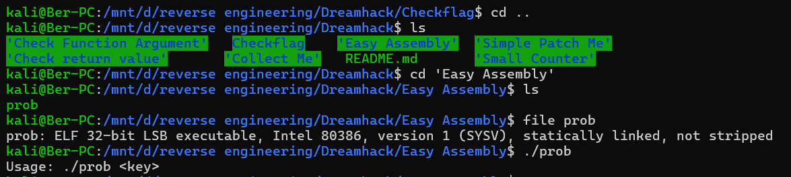
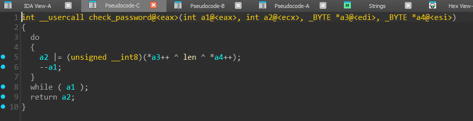

#

## Kiểm tả file



## Dùng IDA để biên dịch sang ASM


- Ở đây ta có thể biết chắc rằng enc_flag là flag ta cần tìm.
- Chuỗi của ta nhập và sẽ được lưu ở esi, còn chuỗi flag được lưu về esi.

## Truy cập vào hàm check_password


- Khúc này đã quá rõ để tìm password, ta sẽ làm ngược lại các bước trên bằng đoạn code dưới đây

## Ta có đoạn code decrypt như sau

```
enc_flag = [0x74, 0x78, 0x4B, 0x65, 0x77, 0x48, 0x5C, 0x69, 0x68, 0x7E, 0x5C, 0x79, 0x77, 0x62, 0x46, 0x79, 0x77, 0x05, 0x46, 0x54, 0x73, 0x72, 0x59, 0x69, 0x68, 0x7E, 0x5C, 0x7E, 0x5A, 0x61, 0x57, 0x6A, 0x77, 0x66, 0x5A, 0x52, 0x02, 0x62, 0x5C, 0x79, 0x77, 0x5C, 0x00, 0x7C, 0x57, 0x0D, 0x0D, 0x4D, 0x00]

len = 48

key = [0] * len
tmp = ""

for i in range(len):
    key[i] = enc_flag[i] ^ len
    tmp = tmp + chr(key[i])

print(tmp)
```

--> Flag: `` DH{UGxlYXNlIGRvIG5vdCBiYXNlNjQgZGVjb2RlIGl0Lg==}``