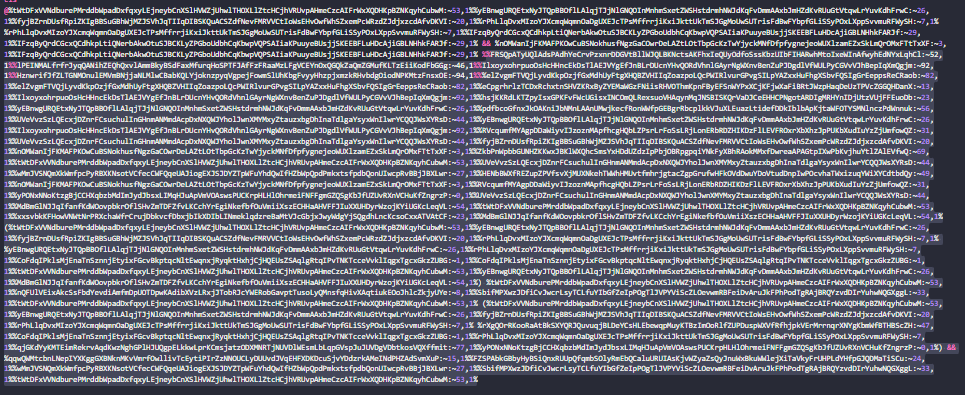

# Write-ups

## Mục lục
- [[CodeEngn] Malware L06](#codeengn-malware-l06)
- [[CodeEngn] Malware L07](#codeengn-malware-l07)
- [r-xor-t](#r-xor-t)
- [secret message](#secret-message)
- [Easy Assembly](#easy-assembly)
- [Batch checker](#batch-checker)

# [CodeEngn] Malware L06
## Định nghĩa ThreatMutex
- Thread Mutex (Mutual Exclusion) là cơ chế khóa dùng trong lập trình đa luồng để đảm bảo chỉ 1 luồng được vào vùng “tài nguyên dùng chung” (critical section) tại một thời điểm, tránh race condition (ghi/đọc chồng chéo gây lỗi dữ liệu).

## Ở trong File PDF, ta thấy có hàm ``CreateMutexA``, ta xem một số thông tin hàm đó như sau

https://learn.microsoft.com/en-us/windows/win32/api/synchapi/nf-synchapi-createmutexa


- Syntax của hàm trên cho ta thấy lpName là tên của Mutex
- Ta có 2 Mutex như sau:


- Mutex thứ nhất dùng để tạo một luồng ở phía trên nó, còn mutex thứ 2 là ``thread mutex``.

---> Flag: ``smtp_bagla_1000``

---
# [CodeEngn] Malware L07

## Đề cho ta một file PDF


## Quét nhanh qua code thì ta thấy có một vòng lặp


- Mạnh dạn đoán đó là vòng lặp khi không truy cập được Web.
- Ta thấy trước hàm sleep, có câu lệnh ``push 96000h``.
- Đây chính là thời gian nghỉ giữa các lần truy cập web.

## Sử dụng python để chuyển mã hex sang dec


---> Flag: ``614400``

---
# r-xor-t

## Bỏ file thực thi vào IDA và phân tích
- Nhấn shift + F12 để tìm các chuỗi trong file


- đúp chuột vào `Nice!`


- Nhấn vào `aNice`và gõ x để đến hàm dùng chuỗi này


- F5 để biên dịch chương trình


- Ta thấy các phép biến đổi được làm tường tự, ta chỉ cần code làm ngược lại bằng đoạn code sau

```
tmp = b'C@qpl==Bppl@<=pG<>@l>@Blsp<@l@AArqmGr=B@A>q@@B=GEsmC@ArBmAGlA=@q'
res = ''.join(chr((b ^ 3) - 13) for b in tmp[::-1])
print(res)
```

---> Tìm được password của chương trình như sau: `e615b75a4d563ac971466e05641d7aed556b62fcb460b6027f126bff411bfe63`

- Thực thi chương trình và nhập ``Input`` vào, ta được Flag


---> Flag: ``DH{e615b75a4d563ac971466e05641d7aed556b62fcb460b6027f126bff411bfe63}``

---
# secret message

## Tải và giải nén file

## Dùng IDA để biên dịch file prob


- Nhấn đúp vào main và gõ F5 để biên dịch sang C


- Ta thấy file thực thi mở `secretMessage.raw` và xóa đi sau khi sử dụng trong hàm `sub_7FA`.

## Ta bắt đầu đi sâu vào hàm ``sub_7FA``
- Bên trong hàm có được code dưới dạng C như sau.
```c
__int64 __fastcall sub_7FA(FILE *a1, FILE *a2)
{
  unsigned __int8 v3; // [rsp+17h] [rbp-9h]
  int c; // [rsp+18h] [rbp-8h]
  int v5; // [rsp+1Ch] [rbp-4h]

  if ( a1 && a2 )
  {
    v5 = -1;
    v3 = 0;
    while ( 1 )
    {
      c = fgetc(a1);
      if ( c == -1 )
        return 0LL;
      fputc(c, a2);
      if ( c == v5 )
      {
        v3 = 0;
        while ( 1 )
        {
          c = fgetc(a1);
          if ( c == -1 )
            break;
          if ( c != v5 )
          {
            fputc(v3, a2);
            fputc(c, a2);
            v5 = c;
            break;
          }
          if ( ++v3 == 0xFF )
          {
            fputc(255, a2);
            v5 = -1;
            break;
          }
        }
      }
      else
      {
        v5 = c;
      }
      if ( c == -1 )
      {
        fputc(v3, a2);
        return 0LL;
      }
    }
  }
  else
  {
    *__errno_location() = 2;
    return 0xFFFFFFFFLL;
  }
}
```
- Trước khi phân tích thì ta cần biết vài khái niệm sau 
    - ``c = fgetc(a1)``: đọc một kí tự từ file ``a1``
    - ``putc(c, a2)``: ghi kí tự ``c`` vào file ``a2``.

- Đoạn code sẽ lần lượt lấy các kí tự của ``a1`` và viết vào ``a2`` với nguyên tắc như sau:
    - `c` là kí tự hiện tại của `a1`.
    - `v5` là kí tự trước đó đang xét so với `c`.
    - `v3` là bộ đếm số lần ký tự lặp lại.

- Thuật toán nén hoạt động như sau:
    - Đọc một ký tự ``c`` từ input.
    - Ghi ngay lập tức ký tự ``c`` đó ra file  `a2`.
    - So sánh ``c``với ký tự trước đó ``v5``

    - Nếu `c` khác `v5` thì `v5 = c` và bắt đầu vòng lặp mới.
    - Nếu `c` bằng `v5` thì tăng biến `v3` lên một đơn vị

    - Với mỗi một chuỗi có các kí tự giống nhau liên tiếp thì nó chỉ in ra kí tự đầu, kí tự thứ hai và theo sau đó là số lần liên tiếp giống nhau của kí tự đó.

    - Ví dụ: ``input = a a a b b b b b b c c`` thì ``output = a a 1 b b 3 c c 0``

- dựa vào code trên thì ta đã có code encypt, giờ ta sẽ code phần decrypt như sau:
```c
# decode_enc.py
def rle_decode_bytes(data: bytes) -> bytes:
    """
    Giải mã RLE tuỳ biến:
    - Khi gặp 2 byte liên tiếp bằng nhau (b == prev), byte kế tiếp là số đếm N -> ghi thêm N lần b.
    - Các byte khác ghi nguyên xi.
    """
    if not data:
        return b""

    out = bytearray()
    prev = data[0:1]
    out += prev
    i = 1

    while i < len(data):
        b = data[i:i+1]
        out += b

        if b == prev:
            i += 1
            if i >= len(data):
                break  # EOF giữa chừng
            n = data[i]          # byte đếm
            if n:
                out += b * n     # ghi thêm n lần byte lặp
        prev = b
        i += 1

    return bytes(out)


if __name__ == "__main__":
    # Đọc file mã hoá dạng nhị phân
    with open("secretMessage.enc", "rb") as fi:
        enc = fi.read()

    # Giải mã
    dec = rle_decode_bytes(enc)

    # Ghi ra file kết quả
    with open("secretMessage.dec", "wb") as fo:
        fo.write(dec)

    print("Đã giải mã -> secretMessage.dec")

```

- Sau khi thực thi file trên thì nó in ra ``secretMessage.dec`` cho mình với tất cả mã byte bên trong.
- Ta thực thi file ``imageviewer.py`` bằng câu lệnh để lấy ``secretMessage.dec`` làm tham số.


- Sau khi thực thi chương trình, ta có ảnh như sau:


--> Flag: ``DH{93589e6c1db065fa95075ab5e3790bc1}``

---
# Easy Assembly

## Kiểm tra file


## Dùng IDA để biên dịch sang ASM


- Ở đây ta có thể biết chắc rằng enc_flag là flag ta cần tìm.
- Chuỗi của ta nhập và sẽ được lưu ở esi, còn chuỗi flag được lưu về esi.

## Truy cập vào hàm check_password


- Khúc này đã quá rõ để tìm password, ta sẽ làm ngược lại các bước trên bằng đoạn code dưới đây

## Ta có đoạn code decrypt như sau

```c
enc_flag = [0x74, 0x78, 0x4B, 0x65, 0x77, 0x48, 0x5C, 0x69, 0x68, 0x7E, 0x5C, 0x79, 0x77, 0x62, 0x46, 0x79, 0x77, 0x05, 0x46, 0x54, 0x73, 0x72, 0x59, 0x69, 0x68, 0x7E, 0x5C, 0x7E, 0x5A, 0x61, 0x57, 0x6A, 0x77, 0x66, 0x5A, 0x52, 0x02, 0x62, 0x5C, 0x79, 0x77, 0x5C, 0x00, 0x7C, 0x57, 0x0D, 0x0D, 0x4D, 0x00]

len = 48

key = [0] * len
tmp = ""

for i in range(len):
    key[i] = enc_flag[i] ^ len
    tmp = tmp + chr(key[i])

print(tmp)
```

--> Flag: `` DH{UGxlYXNlIGRvIG5vdCBiYXNlNjQgZGVjb2RlIGl0Lg==}``

--- 
# Batch checker

## Đề bài cho ta một file có đuôi bat
- Bổ sung kiến thức: File .bat là một loại tệp văn bản thuần túy (plain text file) chứa một chuỗi các lệnh mà hệ điều hành Windows (cũng như MS-DOS trước đây) sẽ thực thi tuần tự, từng lệnh một, giống như thể bạn đang gõ chúng vào Command Prompt (CMD).

- Trong file sẽ có 2 phần: 
  - ``SET  "vFKIqCf...bUIryEWWNrCSRc=ulZiZYfKD...enBoJNWtVH"``:


---> SET "name=content": Đặt biến `name` với nội dung là `content`.


  - ``%tWtDFx....hCubwM:~53,1%``:


---> ``%name:~n,x%``: Lấy ``x`` kí tự bắt đầu từ vị trí thứ ``n`` trong chuỗi có tên là `name`.

- Ta paste phần SET lên trên ``CMD``, để set up các biến.
- Ta thấy ở những câu lệnh đầu khi ta dùng câu lệnh `echo` để in ra thì ta được đáp án là `echo off`, này là một câu lệnh tắt hoạt động của ``echo``.
- Vậy nên ta né đoạn trên và bắt đầu `echo` đoạn sau, ta được kết quả như sau:




- ta thấy `FLAG%==BA7cH_cAN_hiDe_u5iNg_text(echo correct) else (echo wrong)`: đây là một câu lệnh if else.

---> Flag: `DH{BA7cH_cAN_hiDe_u5iNg_text}`

