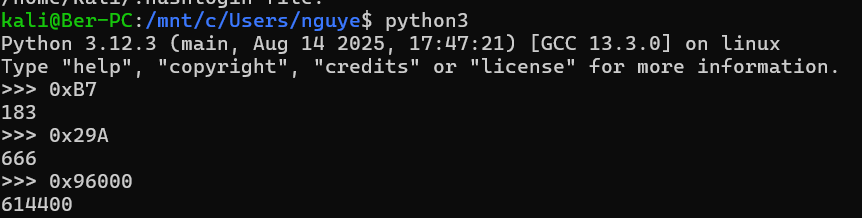

# Write-ups

## Đề cho ta một file PDF

## Quét nhanh qua code thì ta thấy có một vòng lặp

- Mạnh dạn đoán đó là vòng lặp khi không truy cập được Web.
- Ta thấy trước hàm sleep, có câu lệnh ``push 96000h``.
- Đây chính là thời gian nghỉ giữa các lần truy cập web.

## Sử dụng python để chuyển mã hex sang dec

---> Flag: ``614400``