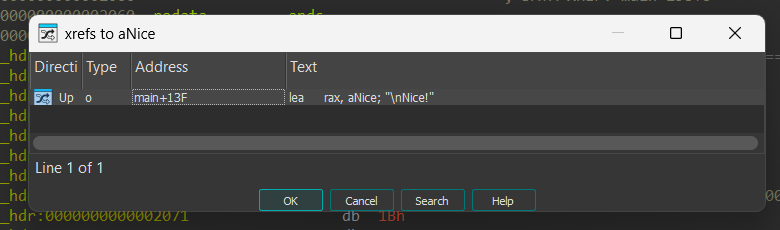
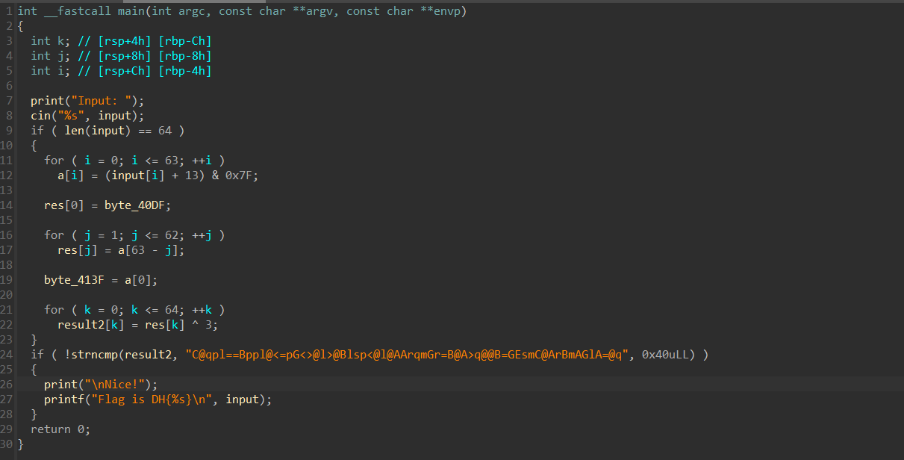

# WRITE_UPS

## Bỏ file thực thi vào IDA và phân tích
- Nhấn shift + F12 để tìm các chuỗi trong file


- đúp chuột vào `Nice!`


- Nhấn vào `aNice`và gõ x để đến hàm dùng chuỗi này




- F5 để biên dịch chương trình



- Ta thấy các phép biến đổi được làm tường tự, ta chỉ cần code làm ngược lại bằng đoạn code sau

```
tmp = b'C@qpl==Bppl@<=pG<>@l>@Blsp<@l@AArqmGr=B@A>q@@B=GEsmC@ArBmAGlA=@q'
res = ''.join(chr((b ^ 3) - 13) for b in tmp[::-1])
print(res)
```

---> Tìm được password của chương trình như sau: `e615b75a4d563ac971466e05641d7aed556b62fcb460b6027f126bff411bfe63`

- Thực thi chương trình và nhập ``Input`` vào, ta được Flag


---> Flag: ``DH{e615b75a4d563ac971466e05641d7aed556b62fcb460b6027f126bff411bfe63}``