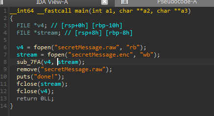
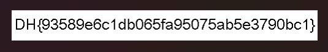

# WRITE-UPS

## Tải và giải nén file

## Dùng IDA để biên dịch file prob


- Nhấn đúp vào main và gõ F5 để biên dịch sang C


- Ta thấy file thực thi mở `secretMessage.raw` và xóa đi sau khi sử dụng trong hàm `sub_7FA`.

## Ta bắt đầu đi sâu vào hàm ``sub_7FA``
- Bên trong hàm có được code dưới dạng C như sau.
```!code
__int64 __fastcall sub_7FA(FILE *a1, FILE *a2)
{
  unsigned __int8 v3; // [rsp+17h] [rbp-9h]
  int c; // [rsp+18h] [rbp-8h]
  int v5; // [rsp+1Ch] [rbp-4h]

  if ( a1 && a2 )
  {
    v5 = -1;
    v3 = 0;
    while ( 1 )
    {
      c = fgetc(a1);
      if ( c == -1 )
        return 0LL;
      fputc(c, a2);
      if ( c == v5 )
      {
        v3 = 0;
        while ( 1 )
        {
          c = fgetc(a1);
          if ( c == -1 )
            break;
          if ( c != v5 )
          {
            fputc(v3, a2);
            fputc(c, a2);
            v5 = c;
            break;
          }
          if ( ++v3 == 0xFF )
          {
            fputc(255, a2);
            v5 = -1;
            break;
          }
        }
      }
      else
      {
        v5 = c;
      }
      if ( c == -1 )
      {
        fputc(v3, a2);
        return 0LL;
      }
    }
  }
  else
  {
    *__errno_location() = 2;
    return 0xFFFFFFFFLL;
  }
}
```
- Trước khi phân tích thì ta cần biết vài khái niệm sau 
    - ``c = fgetc(a1)``: đọc một kí tự từ file ``a1``
    - ``putc(c, a2)``: ghi kí tự ``c`` vào file ``a2``.

- Đoạn code sẽ lần lượt lấy các kí tự của ``a1`` và viết vào ``a2`` với nguyên tắc như sau:
    - `c` là kí tự hiện tại của `a1`.
    - `v5` là kí tự trước đó đang xét so với `c`.
    - `v3` là bộ đếm số lần ký tự lặp lại.

- Thuật toán nén hoạt động như sau:
    - Đọc một ký tự ``c`` từ input.
    - Ghi ngay lập tức ký tự ``c`` đó ra file  `a2`.
    - So sánh ``c``với ký tự trước đó ``v5``

    - Nếu `c` khác `v5` thì `v5 = c` và bắt đầu vòng lặp mới.
    - Nếu `c` bằng `v5` thì tăng biến `v3` lên một đơn vị

    - Với mỗi một chuỗi có các kí tự giống nhau liên tiếp thì nó chỉ in ra kí tự đầu và theo sau đó là số lần liên tiếp giống nhau của kí tự đó.

    - Ví dụ: ``input = a a a b b b b b b c c`` thì ``output = a a 1 b b 3 c c 0``

- dựa vào code trên thì ta đã có code encypt, giờ ta sẽ code phần decrypt như sau:
```!code
# decode_enc.py
def rle_decode_bytes(data: bytes) -> bytes:
    """
    Giải mã RLE tuỳ biến:
    - Khi gặp 2 byte liên tiếp bằng nhau (b == prev), byte kế tiếp là số đếm N -> ghi thêm N lần b.
    - Các byte khác ghi nguyên xi.
    """
    if not data:
        return b""

    out = bytearray()
    prev = data[0:1]
    out += prev
    i = 1

    while i < len(data):
        b = data[i:i+1]
        out += b

        if b == prev:
            i += 1
            if i >= len(data):
                break  # EOF giữa chừng
            n = data[i]          # byte đếm
            if n:
                out += b * n     # ghi thêm n lần byte lặp
        prev = b
        i += 1

    return bytes(out)


if __name__ == "__main__":
    # Đọc file mã hoá dạng nhị phân
    with open("secretMessage.enc", "rb") as fi:
        enc = fi.read()

    # Giải mã
    dec = rle_decode_bytes(enc)

    # Ghi ra file kết quả
    with open("secretMessage.dec", "wb") as fo:
        fo.write(dec)

    print("Đã giải mã -> secretMessage.dec")

```

- Sau khi thực thi file trên thì nó in ra ``secretMessage.dec`` cho mình với tất cả mã byte bên trong.
- Ta thực thi file ``imageviewer.py`` bằng câu lệnh để lấy ``secretMessage.dec`` làm tham số.


- Sau khi thực thi chương trình, ta có ảnh như sau:



--> Flag: ``DH{93589e6c1db065fa95075ab5e3790bc1}``